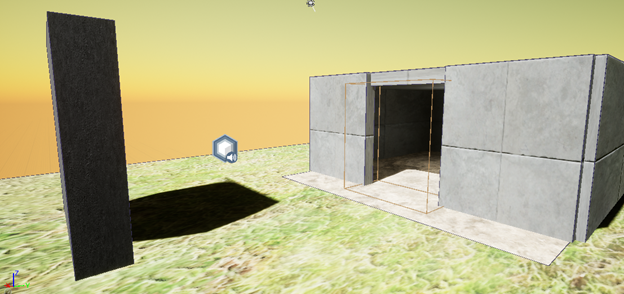
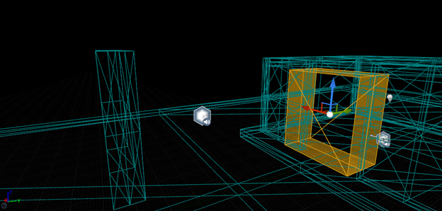
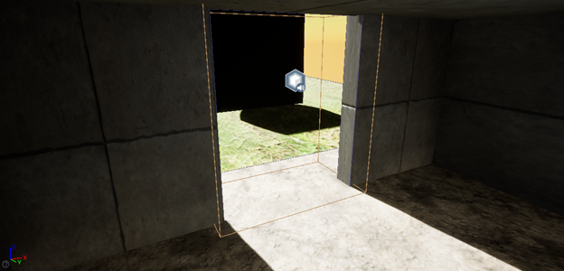
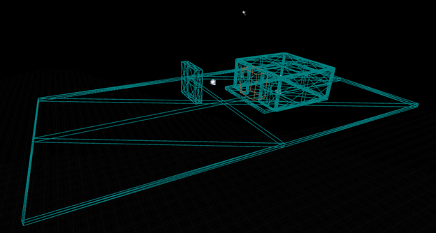
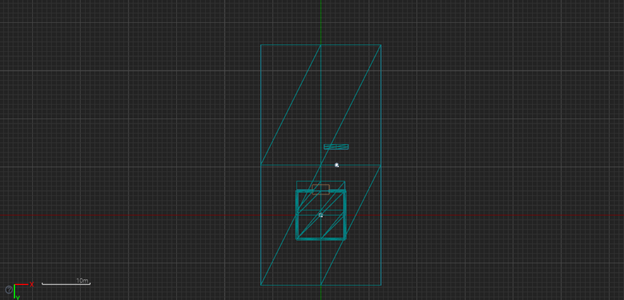

# Unreal Engine and Wwise Details

The Unreal Engine and Wwise audio engine will be where practical application of the AMVRGE plugin will take place. The pipeline for information signal flow will be related to whether or not the plugin is set to gather information or provide signal processing effects.

## Wwise Plugin

### Development Specifications

* The plugin will be developed in C++ using the Wwise audio engine libraries to link the standalone AMVRGE plugin to Wwise
* Plugin type will be "Effect Plugin"
  * Audiokinetic makes the distinction between three different plugin types. They take place within different places in the audio pipeline.
  * Source: Provide audio content to an output buffer using synthesis methods, including physical modeling, modulation synthesis, sampling synthesis, and so on.
  * Effect: Apply DSP algorithms to existing sounds processed as input audio data.
  * Audio Device: Receive audio data at the end of the pipeline and can pass it to other sound systems

## Unreal Engine 4

The environments designed within UE4 are meant to simulate different acoustic situations that a player could encounter. 

### Open Air-Obstacle-Building Level Geometry

The Open Air-Obstacle-Building layout is designed to include

* A building with multiple reflection surfaces and an opening such that many reflections will be encountered within the room but some can leave
* An obstacle opposite the building opening, but askew from it. This will provide the open-air sound source a point of reflection without confinement
* A free field sound source to be heard unimpeded from certain angles \(requires source to be visible to player/listener\)

### Building Interior-Multiroom Level Geometry

\[in development\]

### Building Interior-Hallway Separated Rooms Level Geometry

\[in development\]

